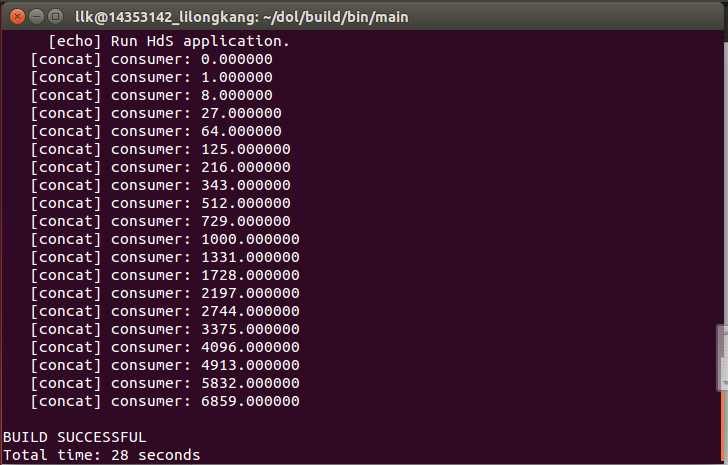
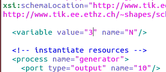

##李隆康 14353142

#嵌入式系统实验Lab2

#一· 实验题目

**1. 修改example1，使其输出三次方；**

- tip:修改square.c

**2. 修改example2，让三个square模块变成两个；**

- tip:修改XML的iterator

#二· 实验内容

#### - example 1
此题需要在square.c里面修改，把 i=iXi 修改成 i=iXiXi 就行了；

最后的结果如下：

#### - example 2
此题需要在XML文件里面，修改，看着长长的代码，可是，只需要我们动一个数字，就是把3改成2；

最后的结果如下：

#三· 实验感想

- 自上一个实验以来，整个人对于Linux的代码修改都更加小心，因为上一次在跑example的时候，竟然因为在修改代码中的一个路径的时候，把一个**小写字母**错写成大写字母，从而反复报错，而且我花了两个小时来检查，这样也是醉了！所以在首次修改的时候就要格外小心，否则在后面很难再检查出来；

- 然后不得不说，这次实验又掉坑了去了，都没看到实验的修改目录是在**/dol/examples/**，我顺利地改在了本应该要删除的dol/build/bin/main里面，而且还做的津津有味，错的太离谱了。要看清题意啊；

- 接下来要说的就是，这个没有你想象中的那么难啊！要修改的代码就是一行呢！所以关键是你是否理解了代码的意思，而且，正如黄凯老师所言，***“成功是要勇于试错的”***，你不试试怎么知道结果呢，就像我自做第二题的时候，要抓狂了，看了有20分钟的代码，各种方法修改，可是最后试试才知道，只要改一个数字，因为他这里用了神奇的迭代器。 